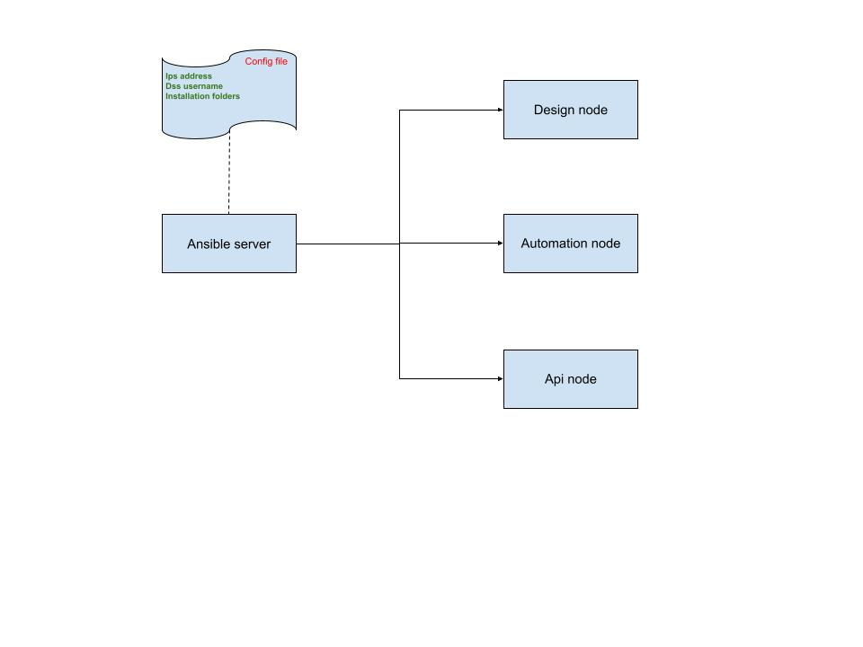

# Dataiku DSS Installation Guide for Linux

## Installation Architecture Diagram



This section should contain a visual diagram showing the relationships between Ansible and the DSS server (Design, Automation, Deployer, API, and Govern nodes).

## Installation Steps

1. Prepare ansible server by following requirements in file _`prerequis.txt`_ and installing ansible requirements on this.
2. Prepare dss dataiku servers following dss requirements
3. Configure ansible files with dss servers informations
4. Launch dss installation from ansible server with playbook


### 1. Prepare Ansible Server

First, copy all files and folders from this repo on ansible servers

- Install ansible with script
```bash
chmod +x ansible-installation.sh
./ansible-installation.sh
```

- Test Ansible on ansible
```bash
export PATH=/home/jeth/.local/bin:$PATH
ansible --version
```

### 2. Prepare dss dataiku servers

- Create the same dss user on all servers
- Servers must communicate each other and with the ansible server 
- ansible user has to have ssh access to all dss servers with root privileges

### 3.Configure ansible files

- Modify following files with right informations:
    - `inventory.ini`
    - all files in folder `group_vars`

refer to file `DEPLOYMENT_README.md` for more details

### 4. Launch ansible playbook

Refer to file `DEPLOYMENT_README.md`


## Dataiku Node Description

### Design Node
The Design Node is the primary development environment where data scientists and engineers create projects, build ML models, and design data pipelines. It serves as the central hub for collaborative work, featuring an interactive IDE for coding, visual workflow builders, and data exploration tools. The Design Node handles project management, version control, and stores all project artifacts and metadata locally.

**Key Functions:**
- Project creation and management
- Data exploration and preparation
- Model development and training
- Pipeline and workflow design
- Code editing and debugging
- Collaboration and commenting

**Primary Role:**
Central development platform for building, testing, and iterating on data workflows before deploying to production environments through Automation or Deployer nodes.


### Automation Node
The Automation Node is responsible for executing scheduled and triggered data workflows in production environments. It runs jobs, pipelines, and scenarios created in the Design Node without requiring user intervention. The Automation Node handles batch processing, data refreshes, and automated model retraining on a defined schedule or based on specific triggers.

**Key Functions:**
- Job scheduling and execution
- Automated workflow orchestration
- Data pipeline automation
- Model retraining and scoring
- Event-based triggering
- Performance monitoring and logging

**Primary Role:**
Production execution engine that automates routine data tasks, ensuring consistent and reliable data processing without manual intervention, complementing the Design Node's development capabilities.


### Deployer Node
The Deployer Node manages the deployment and versioning of projects and models from development to production environments. It acts as a gateway between the Design Node (where projects are created) and the Automation Node (where they execute), ensuring controlled releases, version management, and environment promotion. The Deployer Node maintains a repository of deployable artifacts and handles rollbacks if needed.

**Key Functions:**
- Project and model deployment management
- Version control and artifact storage
- Environment promotion (dev → staging → production)
- Release orchestration and scheduling
- Rollback capabilities
- Deployment validation and testing

**Primary Role:**
Production release manager that bridges development and automation by safely deploying vetted projects from the Design Node to Automation Nodes, ensuring consistency, traceability, and controlled project lifecycle management across environments.


### API Node
The API Node exposes Dataiku DSS functionality through REST APIs, enabling external applications and services to programmatically interact with projects, datasets, and models. It provides a scalable interface for integrating DSS with third-party tools, dashboards, and business applications.

**Key Functions:**
- RESTful API endpoints for project and dataset access
- Model serving and predictions
- Job triggering and monitoring
- Authentication and API key management
- Rate limiting and performance optimization
- Webhook support for event-driven integrations

**Primary Role:**
Integration bridge that allows external systems to consume DSS capabilities without direct UI access, enabling seamless embedding of analytics and ML predictions into enterprise applications and workflows.

**Node Interactions:**
- **Design Node:** Retrieves project definitions, metadata, and artifacts
- **Automation Node:** Triggers jobs and retrieves execution results
- **Deployer Node:** Accesses versioned models and deployable projects
- **External Systems:** Provides programmatic access for third-party applications, BI tools, and custom integrations


### Govern Node
The Govern Node is the centralized hub for data governance, compliance, and risk management across the Dataiku DSS platform. It enforces data policies, monitors data quality, tracks data lineage, and ensures regulatory compliance throughout the entire data lifecycle. The Govern Node provides visibility into how data flows through projects, who accesses sensitive information, and whether governance standards are being met.

**Key Functions:**
- Data lineage and impact analysis
- Data quality monitoring and alerting
- Sensitive data detection and masking
- Access control and permissions management
- Audit logging and compliance reporting
- Policy enforcement and violations tracking
- Metadata management and cataloging

**Primary Role:**
Enterprise governance and compliance engine that ensures data security, quality, and regulatory adherence across all DSS nodes, enabling organizations to maintain data integrity, audit trails, and risk mitigation throughout the analytics pipeline.

**Node Interactions:**
- **Design Node:** Monitors project creation, tracks data transformations, and enforces governance policies during development
- **Automation Node:** Audits job executions, tracks data lineage in automated workflows, and ensures compliance in production runs
- **Deployer Node:** Validates deployment artifacts against governance standards, ensures sensitive models are properly secured before promotion
- **API Node:** Enforces authentication, access controls, and audit logging for external API requests
- **External Compliance Systems:** Integrates with enterprise data catalogs, DLP tools, and regulatory reporting platforms


## Installation Prerequisites
- Linux OS (Ubuntu - 20.04 and 22.04, CentOS, RHEL, or similar)
- Java 8 or later installed
- At least 4GB RAM recommended
- 20GB free disk space minimum
- Internet connection for downloading dependencies